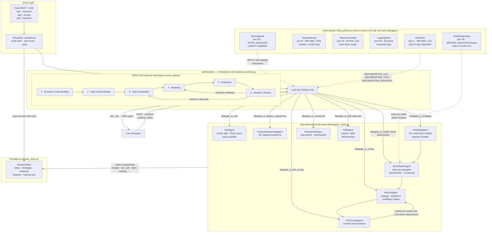

# CLAUDE.md

This file provides guidance to Claude Code (claude.ai/code) when working with code in this repository.

## Commands

### Backend (Python/Flask)

```powershell
# Setup (one-time)
python -m venv .venv
.\.venv\Scripts\Activate.ps1
python -m pip install -r requirements.txt

# Run API server (primary backend)
flask --app backend.server.app run --port 8082 --debug

# Run tests
pytest

# Run a single test file
pytest tests/test_training.py -v
```

### Frontend (React/Vite)

```powershell
cd react-frontend
npm.cmd install   # Windows; use npm install on other platforms
npm.cmd run dev   # Dev server at http://127.0.0.1:5173
npm.cmd run build
```

### Full Stack Development

Run API in one terminal (`flask --app backend.server.app run --port 8082 --debug`), React in another (`cd react-frontend && npm.cmd run dev`). The Vite dev server proxies `/api` to `http://127.0.0.1:8082`, so no CORS config is needed in dev.

### Environment

Copy `.env` with your `OPENAI_API_KEY`. For Azure OpenAI, also set `OPENAI_API_BASE`. Sessions and project data persist to `~/.aiml_discovery/` (override with `AIML_DISCOVERY_HOME`).

## Architecture

This is a local-first tabular ML discovery platform with a React frontend and Python/Flask backend:

### Two Interfaces

1. **React Autopilot Dashboard** (`react-frontend/`) — The primary modern UI. Dark "Tech Academy" theme, Vite + React 18 + Plotly.js. Shows a swimlane graph or linear timeline of agent steps as they happen via SSE. Keyboard shortcuts: `G` (graph view), `T` (timeline view). Slide-in detail drawer, tweaks panel, notebook download.

2. **Flask HTTP Service** (`backend/server/app.py`) — REST + Server-Sent Events. Used by the React frontend; also consumable directly.

### Backend Structure

```
backend/
├── config/
│   └── settings.py            # APP_NAME, PROJECT_HOME, supported extensions
├── logic/
│   ├── autopilot.py           # AiAutopilot facade (thin wrapper around agent system)
│   ├── training.py            # AutoML training (25+ models, TrainingResult)
│   ├── ingestion.py           # Dataset loading (CSV/Excel/JSON/SQLite)
│   ├── notebook_export.py     # Jupyter .ipynb generation
│   ├── diagnostics.py         # Plotly diagnostic charts
│   ├── profiling.py           # Data profiling utilities
│   ├── reporting.py           # Report generation
│   ├── dtype_coercion.py      # Data type helpers
│   └── agents/
│       ├── base.py            # AutopilotStep, AgentContext, BaseAgent
│       ├── scientist.py       # AimlScientist orchestrator
│       ├── hooks.py           # HookEvent, HookOutcome, Hook, HookManager
│       ├── hook_policies.py   # Concrete hooks + default_hook_manager()
│       ├── eda_agent.py
│       ├── feature_engineering_agent.py
│       ├── modeling_agent.py
│       ├── model_tester.py
│       ├── review_agent.py
│       ├── fine_tuning_agent.py
│       ├── researcher_agent.py
│       └── drift_agent.py
├── server/
│   ├── app.py                 # Flask app instance + blueprint registration
│   ├── job_manager.py         # AutopilotJob, background worker threads
│   ├── streaming.py           # SSE helper (event_stream)
│   ├── logging_setup.py       # configure_logging()
│   └── routes/
│       ├── health.py          # GET /api/health
│       ├── projects.py        # GET/POST /api/projects
│       ├── datasets.py        # upload, register, list datasets
│       ├── sessions.py        # autopilot sessions (create/list/stop/SSE/answers)
│       └── runs.py            # list runs, charts, score, notebook download
└── services/
    ├── project_store.py       # ProjectStore, ProjectInfo, DatasetInfo
    ├── session_store.py       # SessionWriter, load_session, list_sessions
    └── tracing.py             # Phoenix/OpenTelemetry optional instrumentation
```

### Agent System

The core AI engine is a multi-agent orchestrator that runs CRISP-DM autonomously:

- **`AimlScientist`** (`backend/logic/agents/scientist.py`) — Orchestrator LLM. Loops up to 60 iterations deciding which specialist to invoke next. Can pause and emit `ask_user` events.
- **`EdaAgent`** — Data profiling and Plotly chart generation; vision-capable (passes chart images back to the LLM).
- **`FeatureEngineeringAgent`** — 50+ dataset transformations.
- **`ModelingAgent`** — AutoML baseline across 25+ scikit-learn models.
- **`ReviewAgent`** — Critiques for leakage, imbalance, underfitting.
- **`FineTuningAgent`** — Iterates on improvements after review.
- **`ResearcherAgent`** — Background domain research.
- **`DriftAgent`** — Feature/label drift detection.

All agents extend `BaseAgent` (`backend/logic/agents/base.py`) and yield `AutopilotStep` dataclass instances. The orchestrator thin-façade is `AiAutopilot` (`backend/logic/autopilot.py`).

### Agent Flow



### Session Model

Each autopilot run is a **session** with a background worker thread. Steps are persisted to disk and streamed to the frontend via SSE. Sessions can be resumed after a restart. The full flow:

```
POST /api/projects/{pid}/autopilot/sessions                    → create session, get session_id
GET  /api/projects/{pid}/autopilot/sessions/{sid}/events       → SSE stream of AutopilotStep
POST /api/projects/{pid}/autopilot/sessions/{sid}/answers      → submit user reply (resumes paused run)
GET  /api/projects/{pid}/autopilot/sessions/{sid}/notebook     → download as .ipynb
```

### Notebook Export

Every agent step produces a Jupyter cell with runnable code (Plotly Express, scikit-learn), a markdown explanation, and actual outputs (charts as base64 PNG, DataFrames as CSV). Exported notebooks are self-contained and human-readable.

### Key Modules

| File | Purpose |
|------|---------|
| `backend/server/app.py` | Flask app + blueprint registration |
| `backend/server/job_manager.py` | Session threading, AutopilotJob lifecycle |
| `backend/server/routes/sessions.py` | Autopilot session endpoints + SSE streaming |
| `backend/logic/agents/scientist.py` | LLM orchestrator loop |
| `backend/logic/agents/base.py` | `AgentContext`, `AutopilotStep`, `BaseAgent` |
| `backend/logic/agents/hooks.py` | Hook framework: events, outcomes, `HookManager` |
| `backend/logic/agents/hook_policies.py` | Concrete hooks (stop, guardrail, steering, gate, logging, tokens) |
| `backend/logic/ingestion.py` | Dataset loading (CSV, Excel, JSON, SQLite) |
| `backend/logic/training.py` | AutoML training with optional XGBoost/LGB/CatBoost |
| `backend/logic/notebook_export.py` | Jupyter notebook generation |
| `backend/services/session_store.py` | Session persistence |
| `backend/config/settings.py` | `APP_NAME`, `PROJECT_HOME`, supported file extensions |
| `react-frontend/vite.config.js` | Port 5173, `/api` proxy to port 8082 |

### Optional Dependencies

XGBoost, LightGBM, CatBoost (AutoML models), SHAP (explainability), Optuna (Bayesian HPO), and pmdarima (time-series) are gracefully skipped if not installed.

## Documentation

- `docs/AUTOPILOT.md` — Agent roles and CRISP-DM lifecycle
- `docs/AUTOPILOT_API.md` — Full HTTP endpoint reference with curl examples
- `docs/AGENT_PLAYBOOK.md` — Agent internal decision-making and tool signatures
- `docs/AGENT_TOOLS.md` — Tool definitions agents can invoke